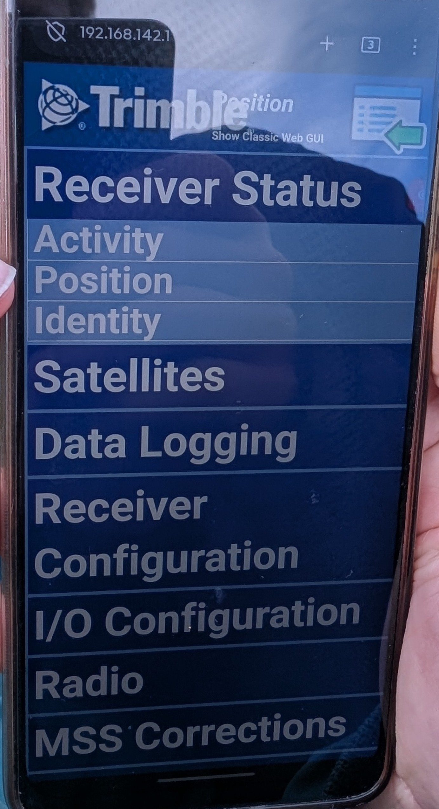
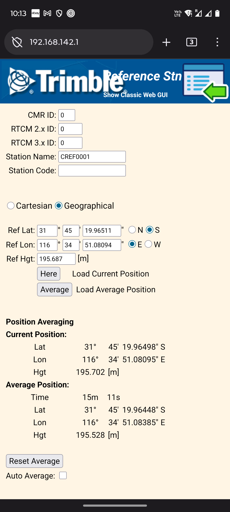
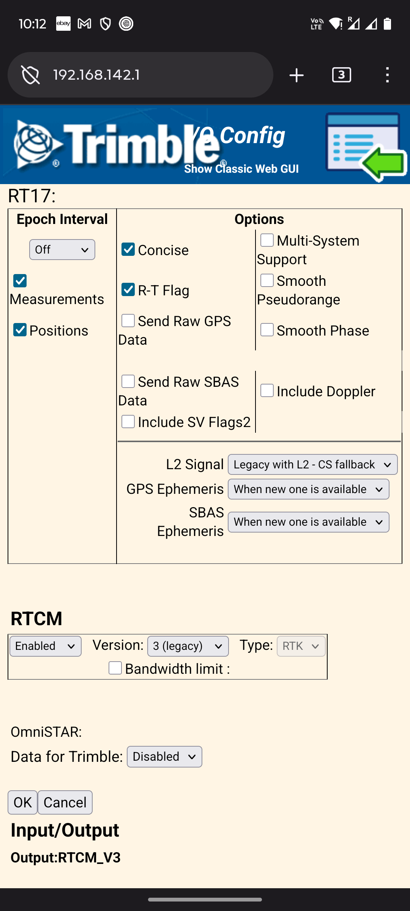
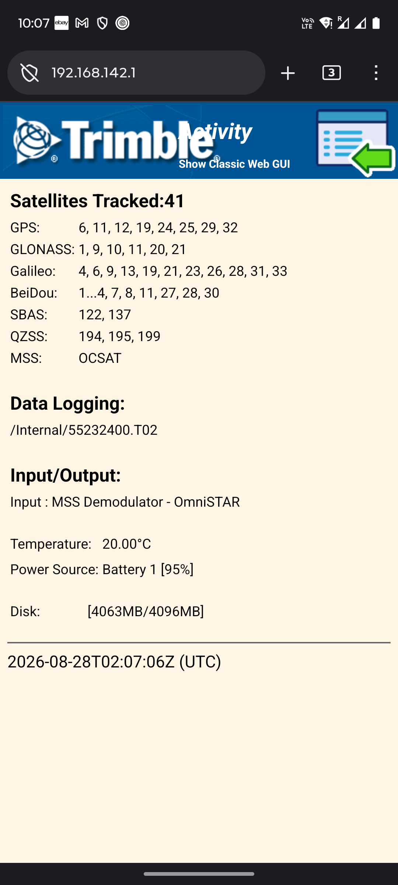

# {{ page.title }}

Use for any surveying where a permanent NTRIP base station is not usable (<50 km away).

## Accessories list

- [ ] Trimble unit.
- [ ] At least 2 internal batteries.
- [ ] External batteries.
- [ ] Battery charger.
- [ ] Tripod.
- [ ] Tribrach.
- [ ] Trimble Base Station Extension.

If needed, RTFM [(Trimble R10)](https://help.fieldsystems.trimble.com/r10/home.htm).

## Physical setup

- Choose a spot where the unit is not going to get bumped into.
- But is still close enough so battery changes are easy.
- Don't worry about levelling.
- Do this early before drone setup.

## Trimble configuration

Soft (Factory reset), if unsure who used it last.
-> Hold power buton for 15-Second.

Connect via WiFi with device to RTk unit:
- Default IP address: is on a sticker on the receiver -> browser.
- Default login: admin/password

 

*   Receiver Configuration – Reference station:  **Critical to do whenever the base station is physically moved**
    *   Click on \[Here\] to load the current position of the receiver as the reference station position.
    *   Click on \[OK\].
    
 

*   I/O config – Port Configuration:
    *   NTRIP caster 1
    *   Mount point: RTCM32MP
    *   RTCM Enable, 3.x (turns green)
    *   If confirm/save on the bottom of the page complains about reference station too far away:

* Quick check all is good:
   * All 3 LED indicators on the RTK base station flashing
   * Receiver status – Activity: Satellites visible, Battery status.

   

  
   

## RTK setup on drone controller

In the drone (M300) controller config:
- [ ] Select RTK Service Type: Custom Network RTK
- [ ] 192.168.1.111
- [ ] port 2101
- [ ] admin/password
- [ ] Mountpoint: RTCM32MP
- [ ] If the drone is complaining, make sure the Reference Station is updated in the Trimble web config.

