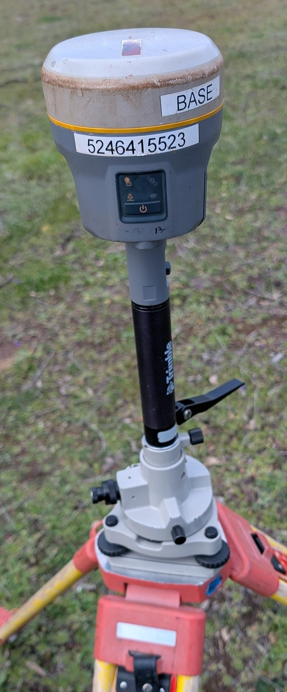
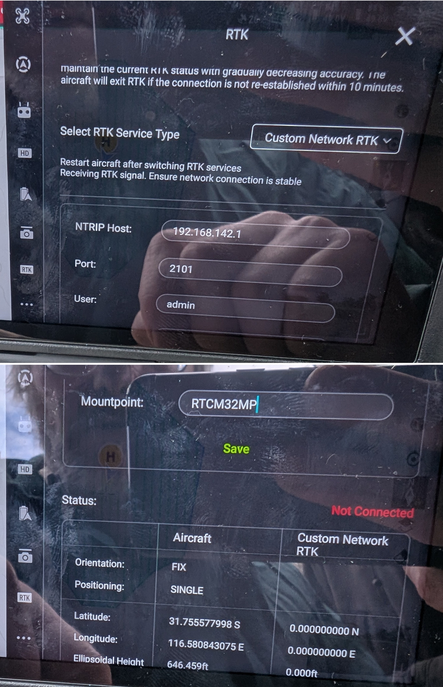

# {{ page.title }}

Use for any surveying where a permanent NTRIP base station is not usable (<50 km away).

## Accessories list

- [ ] Trimble unit.
- [ ] At least 2 internal batteries.
- [ ] External batteries.
- [ ] Battery charger.
- [ ] Tripod.
- [ ] Leveller thingy. **What is this actually called?**
- [ ] Base Station Extension. **What is this actually called?**
- [ ] 
- [ ] 

If needed, RTFM [(Trimble R10)](https://help.fieldsystems.trimble.com/r10/home.htm).

## Physical setup

- Choose a spot where the unit is not going to get bumped into.
- But is still close enough so battery changes are easy.
- Don't worry about levelling.
- Do this early before drone setup.

## Trimble configuration

Soft (Factory reset), if unsure who used it last.
-> Hold power buton for 15-Second.

- Default IP address: is on a sticker on the receiver.
- Default login: admin/password

## RTK setup on drone controller

## ~~Trimble configuration client mode~~ (NOT USED anymore)

Trimble R10 [(help portal)](https://help.fieldsystems.trimble.com/r10/home.htm)

Factory reset if needed - clears all WiFi client settings, that can be whatever from previous user. It starts in WiFi AP mode then.

Default login: admin/password

Default IP address: is on a sticker on the receiver.

*   I/O config – Port Configuration:
    *   NTRIP caster 1
    *   Mount point: RTCM32MP
    *   RTCM Enable, 3.x (turns green)
    *   If confirm/save on the bottom of the page complains about reference station too far away:
*   Receiver Configuration – Reference station:
    *   Click on \[Here\] to load the current position of the receiver as the reference station position.
*   WiFi:
    *   Client configuration: enter SSID and password for Starlink router (or other/alternative WiFi router); Static IP seems to work better than dynamic, assigned by the router - even if the router was configured to assign a fixed IP.
    *   Status: select client mode
    *   In the Starlink app, router list the RTK as "Murata manufacturing" 192.168.1.111  
      _Note: the Rhonda US-riot router had difficulties to work with Starlink, connected to it's Ethernet port as LAN router._

* Set reference station - **Critical to do whenever the base station is physically moved**, even just 10 m:
    * After turning on the RTK basestation, confirm in the RTK web config:  
        Receiver cofiguration -> Reference Station -> Here -> OK        
        _Notes:_  
           * _Otherwise the drone is not happy with RTK corrections - it will either refuse to fly (moved far away) or do the geo tagging incorrectly, woth an offset_  
           * _Other settings in the base station web config are remembered_  

* Quick check all is good:
   * All 3 LED indicators on the RTK base station flashing

* In the drone (M300) controller config:
   * Select RTK Service Type: Custom Network RTK
   * 192.168.1.111
   * port 2101
   * admin/password
   * Mountpoint: RTCM32MP
   * If the drone is complaining, make sure the Reference Station is updated in the Trimble web config (see above)

