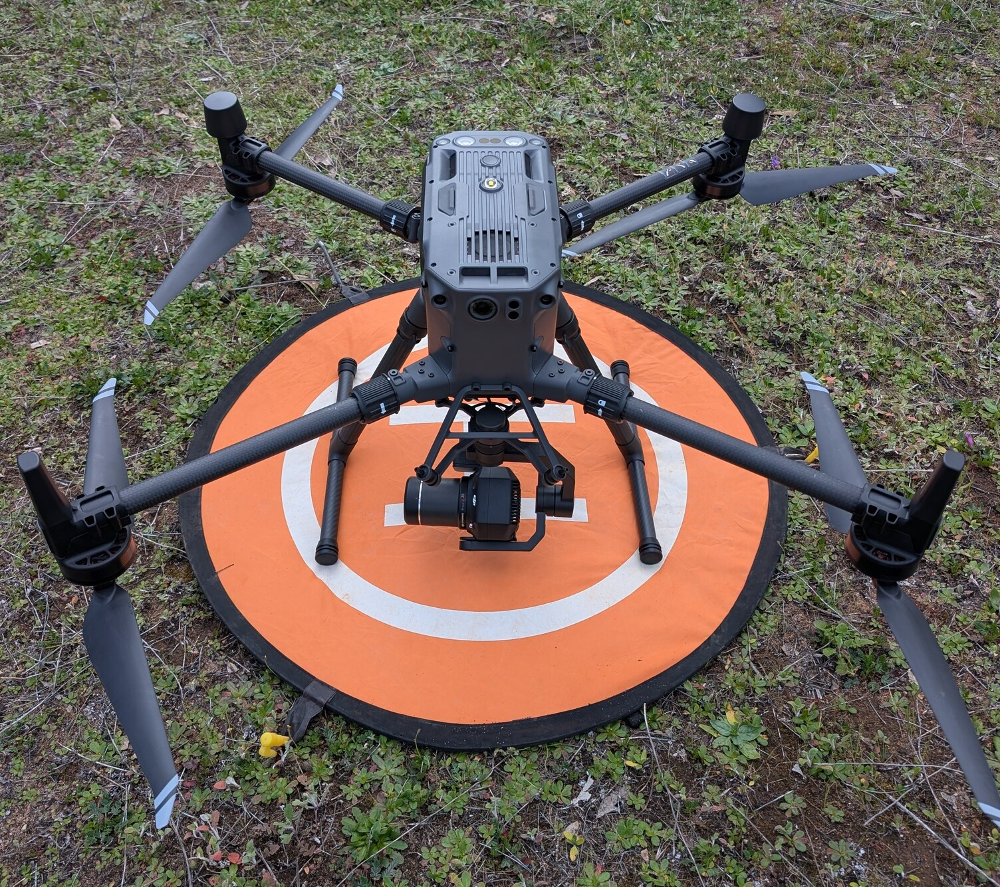

# {{ page.title }}

## Drone
- [ ] Drone.
- [ ] Drone camera + lenses.
- [ ] Drone controller. Internal Battery charged?
- [ ] Drone & Controller external batteries: charge them just before the trip.
- [ ] Battery charger + mains cord.
- [ ] Memory cards. Need couple of good quality >64GB cards. M300 uses SD, modern small drones tend to use micro-SD.
- [ ] USB C-C cable.
- [ ] USB-A thumb drive (to upload flight plan).
- [ ] Landing pad.
- [ ] (optional): stuff for making ground control points (for the low-res ortho survey).
- [ ] [RTK base station pack list](RTK_base_station.html#accessories-list) OR nearby accessible NTRIP broadcaster. [Aus: GA NTRIP](https://gnss.ga.gov.au/stream)

## Computer things
- [ ] Laptop with ~1TB free space.
- [ ] Backup laptop.
- [ ] Memory card reader if not one built-in laptop (test before you leave).
- [ ] (optional): 1TB SSD or hard drive.
- [ ] [Install software package for uploading drone data](https://github.com/desertfireballnetwork/aerial-images-upload-gui).

