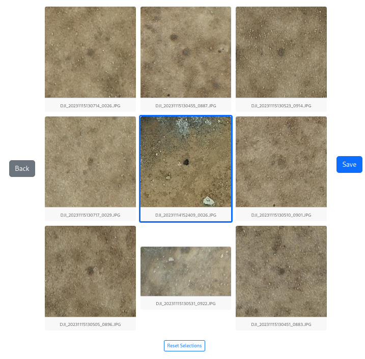
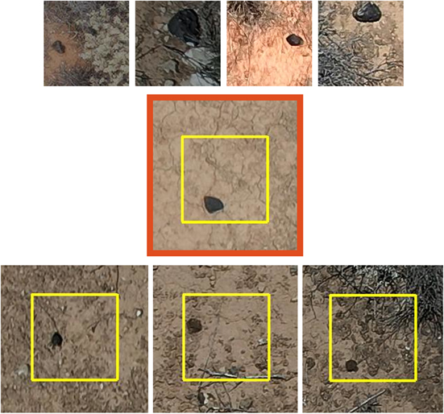

## Introduction

## How to use the interface

You can select promising meteorite candidates by either clickling on them or using the numpad on your keyboard.
Selecting one will toggle a blue border around it.

The 3x3 grid of tiles is mapped to the keyboard numpad like so:

| 7 | 8 | 9 |
| :---: | :---: | :---: |
| 4 | 5 | 6 |
| 1 | 2 | 3 |

Once you have selected all of the promising meteorite candidates, hit `Save` or enter on the keyboard.

### Back button
Have you hit Save accidently too early, want to go back?

That's what the `Back` button is for.

Note: you can only go back to the previous panel, not the ones before that.

## What is a promising meteorite candidate?

[DFN Drone Meteorite Stage 1 sorting tutorial - Seamus - 2024-10-23](https://youtu.be/DPYph0RS6Ko)

To get an idea of what candidates that should not be dismissed look like, figure 5 from Anderson+ 2022:

- TOP ROW: Real meteorites we used to train the ML model
- MIDDLE: DFN09 Kybo-Lintos
- BOTTOM: False positives we had to verify in person (the middle being the least convincing)
