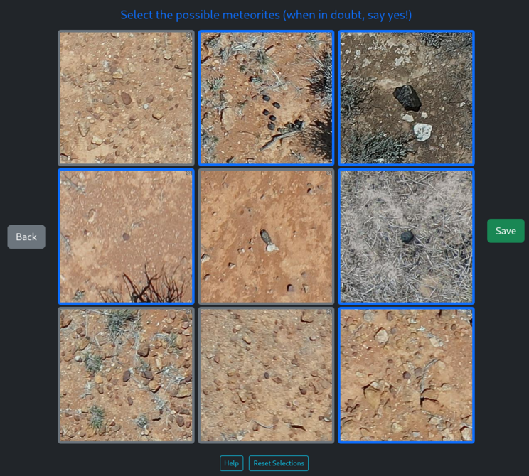
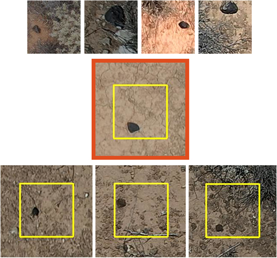

# {{ page.title }}

## Introduction

## How to use the interface

You can select promising meteorite candidates by either clickling on them or using the numpad on your keyboard.
Selecting one will toggle a blue border around it.

The 3x3 grid of tiles is mapped to the keyboard numpad like so:

| 7 | 8 | 9 |
| :---: | :---: | :---: |
| 4 | 5 | 6 |
| 1 | 2 | 3 |

Once you have selected all of the promising meteorite candidates, hit `Save` or enter on the keyboard.

### Back button
Have you hit Save accidently too early, want to go back?

That's what the `Back` button is for.

Note: you can only go back to the previous panel, not the ones before that.

## What is a promising meteorite candidate in stage 1?

Watch Seamus' video:

To get an idea of what candidates that should not be dismissed look like, figure 5 from Anderson+ 2022:

- TOP ROW: Real meteorites we used to train the ML model
- MIDDLE: DFN09 Kybo-Lintos
- BOTTOM: False positives we had to verify in person (the middle being the least convincing)

## Tests
Ramdomly, the app will throw meteorite candidates that are used for training the algorithm.

These are designed to keep users engaged and give early warning of [vigilance decrement](https://en.wikipedia.org/wiki/Vigilance_(psychology)).

If you miss a test, a warning message will apear when you hit save, prompting you to slow down or take a break.

## What is the magnifying glass icon in the corner of each image?

Collaborators and higher level users can see a tiny <i class="fa-solid fa-magnifying-glass-plus"></i> button in the top right corner of the images.

This function should not be be used too often, otherwise it will make your workflow quite slow.
But if you see a candidate that is exceptionally exciting, this button lets you go straight to stage 2 for this candidate.

Note that if the button does nothing, it means the image was a test.

## What the hell is Stage 1.5??

Stage 1.5 is an additional reviewing step.

Sometimes a lot of unconvincing candidates are presented in stage 1,
and users naturally click yes on some of the slightly less unconvincing ones.
The next stage of review (2) being significantly slower (one image at the image),
we can activate stage 1.5 for the survey, candidates that make it through stage 1 are sent to stage 1.5 for a second look before they are sent to [stage 2](stage2_help.html).

