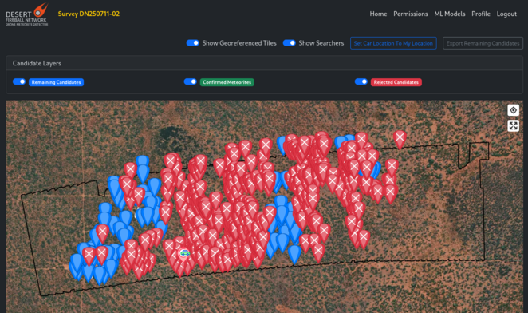

# {{ page.title }}

## Introduction
Stage 4 is the in situ visit of meteorite candidates that remain after the remote sensing assessments.
To facilitate this, a GPS-enabled slippy map is used.
The map has background satellite imagery, with drone survey images overlaid on top, and an interactive layer for the meteorite candidates.

## Accessories list
- [ ] Android mobile device (1 pp). Need good gyro and compass. Cheap devices (<$500) are usually not suitable for this task (Samsung: S series devices are okay, but not the A series). Most people prefer a tablet over a phone for this task.
- [ ] Power bank + charging cable.
- [ ] Personal Locator Beacon (1 pp).
- [ ] Hand-held UHF radio (1 pp) + charger.
- [ ] Garmin GPS unit (1 pp).
- [ ] AA batteries.
- [ ] Water, clothing, first aid kit etc. as appropriate for the site and conditions.

## What to do

### Set up
- [ ] Install the stage 4 app on the tablet.
- [ ] Log in, using same credentials as web version.

### Before heading out
- [ ] Select a batch of candidates while in internet signal, hit "Cache".
- [ ] Make sure you have all the safety equipment from the [Accessories list](#accessories-list).
- [ ] Do not rely on the app for returning to camp. Set a home point on GPS unit (+ on your phone as backup).
- [ ] Let someone know which general direction you are heading towards.

### While out
- [ ] Check in with others regularly using UHF.
- [ ] Revise planned loop if it is taking longer than expected.

### Coming back to camp
- [ ] Charge devices.
- [ ] Synchronise data on mobile device.
- [ ] Check up on others.
- [ ] Rest.

## How to use the Stage 4 app

### Android app
Coming soon!

Doc TODO once app is finished.

### Web browser version
The web version has more or less the same functionalities as the mobile app,
except that it is browser-based.
This means that it cannot cache the data very well.
Use only if you can maintain an internet connection.

